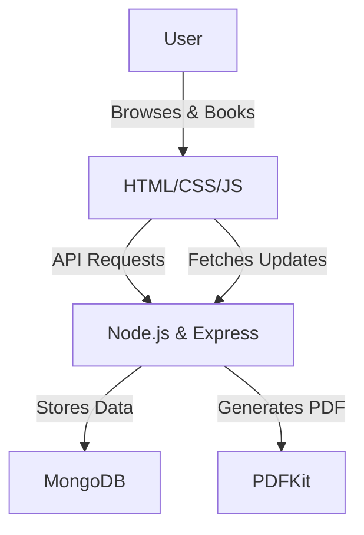

# Travel Booking Website

**A comprehensive travel website for booking, managing, and tracking trips in Nigeria.**


---

## 🌍 **Project Overview**
This project simplifies the travel experience by offering a seamless way to:
- Book and cancel tickets.
- View trip details and overviews.
- Download travel tickets.
- Check pricing for trips.
- Track airports across Nigeria.

Whether you are a frequent traveler, a travel agency, or an airline, this platform aims to make your journey effortless and intuitive.

---

## 🚀 **Key Features**
- **🎟️ Ticket Booking & Cancellation**
   - Book your trips in a few clicks.
   - Cancel unwanted bookings hassle-free.

- **📋 Trip Overview**
   - Get all the essential trip details in a clear and organized format.

- **💾 Downloadable Tickets**
   - Download tickets in a PDF-friendly format.

- **💰 Price Checking**
   - Compare travel prices for trips and choose the best option.

- **🛫 Nigerian Airport Tracker**
   - Search and track airports across Nigeria for your travel needs.

---

## 🛠️ **Tech Stack**
This project was built using:

| **Technology**      | **Purpose**                       |
|----------------------|----------------------------------|
| **HTML5 & CSS3**     | Structure and styling            |
| **JavaScript (ES6+)**| Dynamic behavior and interactivity|
| **Node.js & Express**| Backend services and API         |
| **MongoDB**          | Database for storing travel data |
| **PDFKit**           | Generating downloadable tickets  |

---

## 🎯 **Project Inspiration**
I built this project to address real-world challenges travelers face in Nigeria. Growing up, I watched my family and friends struggle with complicated travel processes, from booking tickets to managing travel schedules. This project is my solution to bring clarity and simplicity to an essential part of our lives: **traveling**.

This project also showcases my **full-stack development skills** and how I approached designing a user-friendly, efficient system.

---

## 🏗️ **Project Architecture**
This project follows a **modular design** to ensure scalability and maintainability.



---

## 🧩 **Challenges & Solutions**

### 📌 **The Most Difficult Challenge**: Generating Downloadable Tickets
#### **Situation**
Travel websites often provide users with downloadable tickets, but integrating this feature dynamically with a backend system posed significant challenges. I needed to ensure ticket generation was fast, secure, and consistent in format.

#### **Task**
- Build a PDF generation service.
- Ensure tickets included user details, trip details, and a clean layout.

#### **Action**
- Implemented **PDFKit** for dynamic PDF generation on the server side.
- Designed a template system to organize ticket information.
- Added error handling and secure file download links.

#### **Result**
- Tickets are now generated dynamically and are available for users to download instantly in a professional format.

---

## 🔍 **How to Run the Project**

### 1️⃣ **Clone the Repository**
```bash
git clone https://github.com/your-username/travel-booking-website.git
cd travel-booking-website
```

### 2️⃣ **Install Dependencies**
```bash
npm install
```

### 3️⃣ **Setup Environment Variables**
Create a `.env` file in the root directory and add:
```
PORT=5000
MONGO_URI=your_mongodb_connection_string
```

### 4️⃣ **Start the Server**
```bash
npm start
```

### 5️⃣ **Open the Application**
Visit `http://localhost:5000` in your browser.

---

## 📝 **Future Iterations**
In the future, I plan to:
- Add **user authentication** for more personalized experiences.
- Integrate **payment gateways** to enable online ticket purchases.
- Implement a **recommendation engine** for optimized trip suggestions.

---

## 📸 **Screenshots**
| Feature               | Screenshot                       |
|-----------------------|----------------------------------|
| **Booking Page**      |  |
| **Download Ticket**   |    |
| **Airport Tracker**   |  |

---

## 🙌 **Lessons Learned**
This project challenged me to:
1. Improve my **backend architecture** skills with Node.js.
2. Master dynamic **PDF generation**.
3. Build efficient **API endpoints** for a smoother user experience.

---

## 💡 **Why This Project Matters**
By building this platform, I aimed to solve real challenges for travelers while demonstrating my ability to design, develop, and deliver a full-stack web application.

Recruiters: This project highlights my problem-solving mindset, technical skills, and passion for creating user-centered solutions.

---

## 🧑‍💻 **About Me**
I’m a software developer with 20 years of experience. I specialize in creating web applications that are functional, efficient, and user-friendly. I’m passionate about solving real-world problems through code.

If you’re hiring or want to collaborate, feel free to connect!

**Portfolio**: [Your Portfolio Link]
**LinkedIn**: [Your LinkedIn Profile]
**Email**: [Your Email]

---

## ⭐ **Support the Project**
If you find this project helpful or interesting, please **star this repository**. It motivates me to build more!